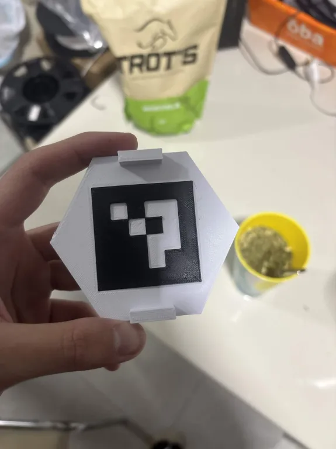
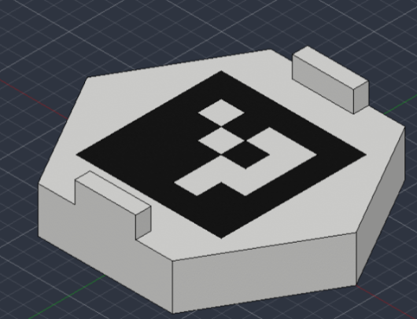

# ArUco cell

The ArUco cell provides a visual reference for locating HiveBoard in camera images. It can support board-pose estimation and alignment of physical and simulated scenes once the marker dimensions and its placement on the board are known.

The cell has two interlocking parts, printed separately in white and black PLA. The white base forms the hexagonal support and the white regions of the marker. The black insert completes the marker pattern. The parts fit together and can be glued after checking their alignment.

This is an optional accessory. The benchmark evaluation remains 13 conditions with five trials per condition.

## Files

| File | Purpose | Material |
|---|---|---|
| [aruco_cell_base_white.obj](aruco_cell_base_white.obj) | Hexagonal base and white marker regions | White PLA |
| [aruco_cell_marker_black.obj](aruco_cell_marker_black.obj) | Black marker insert | Black PLA |
| [aruco_cell_assembly.obj](aruco_cell_assembly.obj) | Assembled reference with both parts in position | White and black |

Keep each OBJ beside its matching MTL file. The MTL files assign the display colors. Choose the corresponding filament when slicing each physical part. The assembly OBJ shows the intended fit and orientation.

These are mesh exports. Vertex positions, faces, and exported scale are preserved from the supplied files. Filenames, object groups, and material names have been standardized in English, and the OBJ material links have been updated.

## Printing and assembly

1. Import the white base and black insert into the slicer as separate parts. Check the model dimensions and apply the same scale factor to both parts.
2. Print the base in white PLA and the insert in black PLA. Use the repository's recommended PLA profile as a starting point and inspect the mating surfaces for stringing or excess material.
3. Fit the two parts together in the orientation shown in the assembly model. Check that the marker pattern is complete and the insert is fully seated.
4. If permanent assembly is required, apply a small amount of PLA-compatible adhesive to the mating surfaces. Keep adhesive away from the visible marker face. Let it cure before mounting.
5. Seat the assembled cell in the honeycomb base and check that it remains fixed. Keep the marker visible to the camera during use.

## Dimensions and marker configuration

OBJ files do not specify physical units. The supplied assembly has coordinate extents of **8.81 × 7.629684 × 2.2**, and the black square has side length **4.750497**, in exported coordinate units. Confirm the intended physical dimensions before printing or importing the model into a simulator. The files have not been rescaled.

The supplied files do not identify the ArUco dictionary or marker ID. Confirm both with the designer and check detection on the printed part. For pose estimation, measure the square marker side from the outer edges of its black border and use calibrated camera parameters. Record the marker's location and orientation relative to the board so that its estimated pose can be converted to a board pose.

Record the dictionary, marker ID, measured marker side length, model scale, and marker-to-board transform with each setup. Detection accuracy and physical-to-simulation alignment need to be measured in the intended camera and lighting configuration.

See the [OpenCV ArUco detection documentation](https://docs.opencv.org/4.x/d5/dae/tutorial_aruco_detection.html) for dictionary selection, detection, and pose estimation.

## Reference images

### Printed cell

### Assembly model

