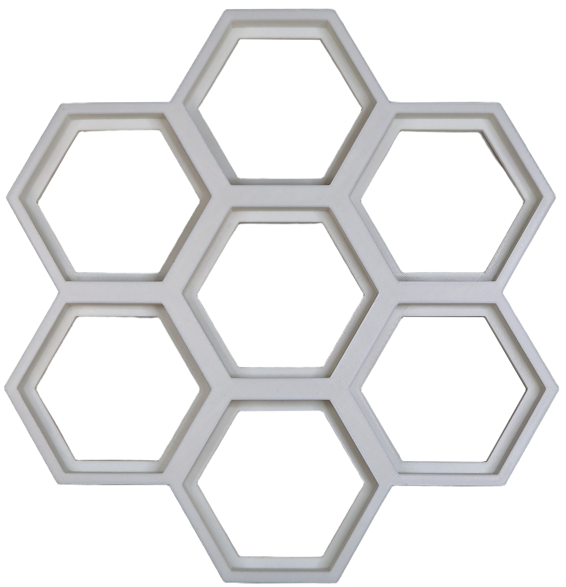
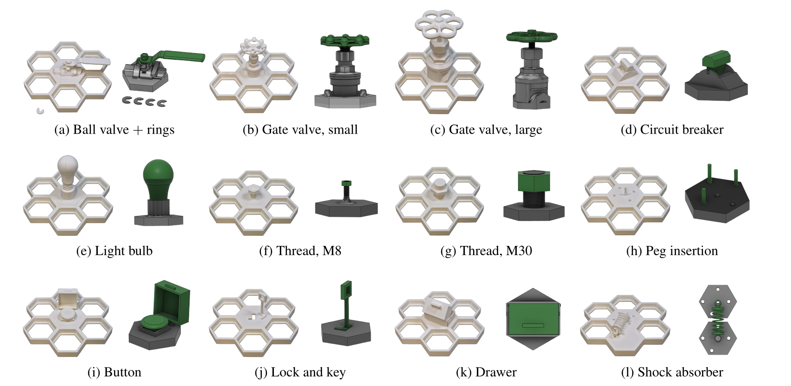
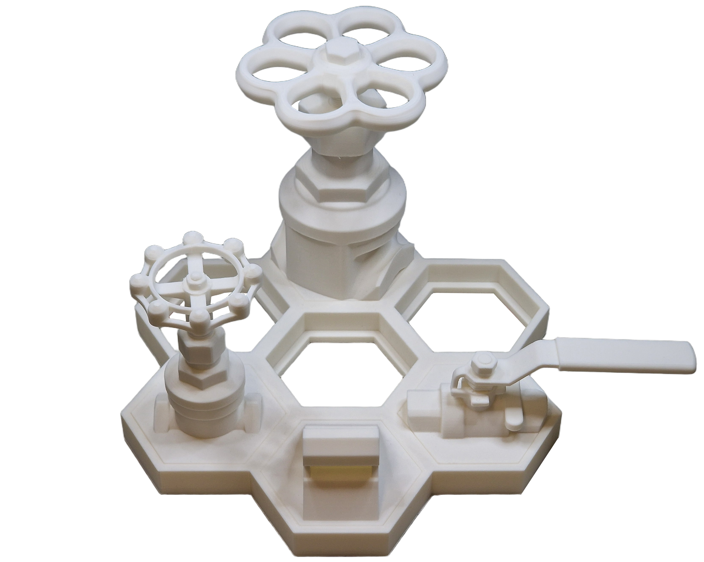
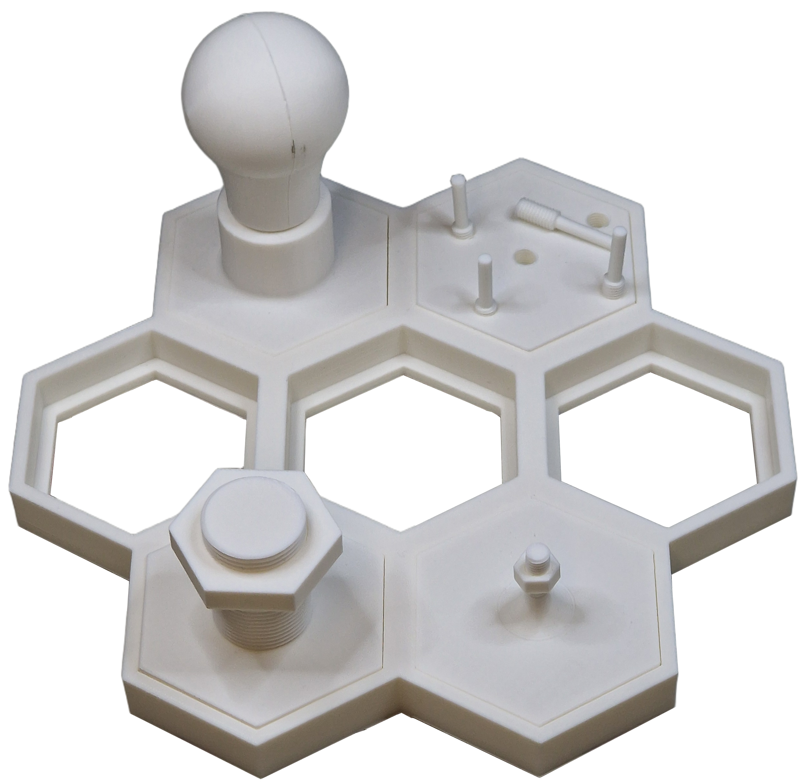
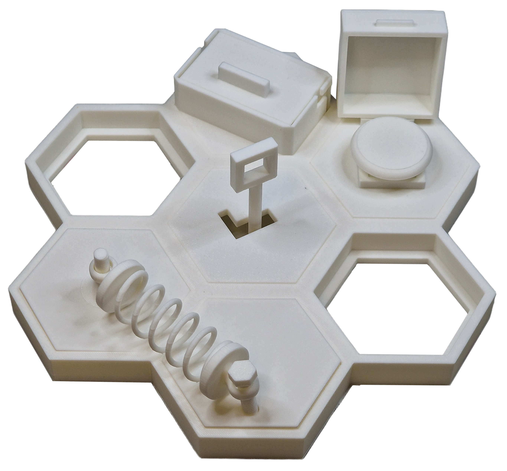

# HiveBoard: An Open, Modular, 3D-Printed Benchmark of Industrial Mechanisms for Robotic and Prosthetic Manipulation

<p align="center">
    <picture>
  <source media="(prefers-color-scheme: dark)" srcset="Images/HIVEBOARD_logo_dark.png" width="50%">
  <source media="(prefers-color-scheme: light)" srcset="Images/HIVEBOARD_logo_light.png" width="50%">
  
    </picture>
</p>

Project page: https://hiveboard-bench.github.io

Demonstration video: https://youtu.be/kaYB_Oc64nA

## Overview

HiveBoard is an open, modular, accessible, fully 3D-printable benchmark for manipulation of functional mechanisms. Manipulation is usually benchmarked on free objects, through grasping and pick-and-place of loose parts. However, many manipulation tasks require the ability to operate different mechanisms and meet different constraints, such as turning a valve, advancing a screw that only engages along its thread, and opening a lock only after a key is inserted and turned. HiveBoard poses those tasks in a form any laboratory can print, and the attachments assume no particular gripper width, approach axis, or mounting frame, so a robot gripper, a dexterous hand, and a worn prosthetic hand can be scored on the same artifact under the same protocol.

The platform is designed around three principles:

- **Low-cost reproducibility** using consumer-grade FDM 3D printers
- **Modular task expansion** through interchangeable attachments
- **Simulation-ready assets** for robotics research and sim-to-real workflows

The system consists of a **hexagonal honeycomb base** that accepts interchangeable attachments representing industrial manipulation tasks such as:

- Valves
- Circuit breakers
- Threaded fasteners
- Peg insertion
- Drawer manipulation
- Lock-and-key
- Shock absorber assemblies

All components in this repository are printable in **PLA filament**.

---

## Project Architecture

<p align="center">
    
</p>


The HiveBoard base contains seven hexagonal cells arranged in a honeycomb pattern. Each attachment uses a standardized press-fit mounting geometry, allowing rapid reconfiguration without screws or fasteners.

This modular architecture enables:

- Fast task swapping
- Difficulty scaling
- Multi-task robotic evaluations
- Easy extension with new attachments

---

## Attachment Categories

<p align="center">
    
</p>

<p align="center">
    <em>The 13 attachments, each shown mounted on the honeycomb base and as an isolated render.
    Panel (a) covers both ball-valve configurations, the lever alone and the lever with the
    friction rings fitted, which are scored as separate trial sets.</em>
</p>

### 1. Torque-Based Tasks

<p align="center">
    
</p>

These tasks evaluate force control and rotational manipulation capabilities.

Included components:

| Attachment | Description |
|---|---|
| Ball Valve | Quarter-turn valve with a lever handle |
| Friction Rings | Snap-on rings (set of four) that increase rotational friction, and therefore torque resistance, on the ball valve |
| Gate Valve (Small) | Compact gate valve with a smaller handwheel |
| Gate Valve (Large) | Larger gate valve with a bigger handwheel and more mechanical advantage |
| Circuit Breaker | Toggle-style industrial breaker |

The friction-ring system gives multiple torque levels on the ball valve without printing additional valves. Each ring sets a different rotational friction.

---

### 2. Precision-Based Tasks

<p align="center">
    
</p>

These tasks focus on alignment, insertion, and fine manipulation.

Included components:

| Attachment | Description |
|---|---|
| Light Bulb Socket | Threaded bulb-and-socket assembly |
| Thread M8 | Small threaded fastener |
| Thread M30 | Large threaded fastener |
| Peg Insertion Plate | Threaded 8 mm pins that must be aligned and then rotated down until seated, not a clearance fit |

These attachments challenge grasp precision, fine alignment, and the ability to keep a small part held while it is turned.

---

### 3. Composed Assembly Tasks

<p align="center">
    
</p>

These tasks involve multiple sequential manipulation stages.

Included components:

| Attachment | Description |
|---|---|
| Hidden Push Button | Hinged cover plus button press |
| Lock and Key | Insertion and rotational unlocking |
| Sliding Drawer | Linear motion manipulation |
| Shock Absorber | Multi-part assembly that occupies two adjacent cells |

The composed tasks allow evaluation of multi-stage manipulation behavior under stage-wise scoring.

---

## Included STL Components

| Category | Part |
|---|---|
| Base System | Hexagonal Honeycomb Base |
| Torque Tasks | Ball Valve |
| Torque Tasks | Friction Rings |
| Torque Tasks | Gate Valve, Small |
| Torque Tasks | Gate Valve, Large |
| Torque Tasks | Circuit Breaker |
| Precision Tasks | Light Bulb Socket |
| Precision Tasks | Thread M8 |
| Precision Tasks | Thread M30 |
| Precision Tasks | Peg Insertion Plate (see note below) |
| Assembly Tasks | Hidden Button |
| Assembly Tasks | Lock and Key |
| Assembly Tasks | Sliding Drawer |
| Assembly Tasks | Shock Absorber |

We have included test files for printing the threads to ensure a successful print without wasting filament.

---

## Recommended 3D Printing Settings

Full Guide: [HiveBoard - Module-Specific Instructions.pdf](https://github.com/user-attachments/files/29721347/HiveBoard.-.Module-Specific.Instructions.1.pdf)


**Recommended Print Bed Size:** 300 × 300 mm.

The HiveBoard system was designed around consumer-grade FDM printers with a minimum build volume of 300 × 300 mm, allowing the complete honeycomb base and all attachments to be printed without splitting large structural parts. This ensures better dimensional accuracy, improved press-fit consistency between modules, and simpler assembly across different printers and laboratories.

### Standard PLA Profile

| Setting | Value |
|---|---|
| Material | PLA |
| Nozzle Diameter | 0.4 mm |
| Layer Height | 0.20 mm |
| Wall Count | 4 |
| Top Layers | 5 |
| Bottom Layers | 5 |
| Infill | 15 to 30%, see per-part table below |
| Print Speed | 50 mm/s |
| Nozzle Temperature | 200 to 220°C |
| Bed Temperature | 50 to 60°C |
| Cooling Fan | 100% |
| Supports | Only where required |
| Adhesion Type | Skirt or Brim |

---

### Recommended Infill Per Part Type

| Part Type | Recommended Infill |
|---|---|
| Base Structure | 20% |
| Mechanical Parts | 25% |
| Torque Components | 30% |
| Threads | 25% |
| Decorative Covers | 15% |

---

### Suggested Print Orientation

| Component Type | Orientation |
|---|---|
| Threads / Screws | Vertical |
| Nuts | Flat |
| Valves | Handle Up |
| Drawer | Flat on largest face |
| Pegs | Vertical |
| Shock Absorber Parts | Sideways |

---

## Simulation Compatibility

<!-- TODO: add a simulation screenshot here, e.g. Images/simulation_assets.png -->

The HiveBoard project also includes simulation-ready CAD assets suitable for:

- MuJoCo
- PyBullet
- Isaac Sim
- ROS-based simulators

The digital assets contain:

- Joint definitions with physical ranges and limits
- Collision meshes
- Mass properties estimated from part volume and PLA density
- Revolute, continuous, and prismatic joints
- URDF and USD exports

Screw motion, on the gate valves, the threaded fasteners, and the light bulb socket, is modelled as a
coupled pair of joints, a continuous rotation about the thread axis and a prismatic translation along
it, which reproduces the advance of the part without requiring a native helical joint type. The
drawer, the lock, and the shock absorber carry their articulation in the USD assets.

The assets have been checked to load in MuJoCo, PyBullet, and Isaac Sim, with each joint driven
through its full range and no self-intersection in the rest configuration. Joint friction, mass, and
inertia are nominal values rather than values identified from one printed instance, because contact
properties depend on the printer, filament, and slicer calibration at each site. Override them in the
asset files if you need tighter correspondence to your own print.

---

## Evaluation Protocol

A reproducible operator-driven protocol is provided for benchmarking grippers, hands, and policies on HiveBoard:

- [`PROTOCOL.md`](Documentation/PROTOCOL.md): the full protocol, including success criteria, per-attachment timeouts, and stage definitions for the composed assembly tasks.
- [`HOW_TO_FILL_TRIALS.md`](Documentation/HOW_TO_FILL_TRIALS.md): column-by-column instructions for the trial logging template.
- [`trials.csv`](Documentation/trials.csv) and [`trials.xlsx`](Documentation/trials.xlsx): pre-populated logging template with one row per trial (5 trials per attachment, 65 rows total). Use the xlsx for filling in (frozen header, dropdowns, color-coded categories); the CSV is provided for scripts.

The protocol prescribes 5 recorded trials per attachment per platform. A platform is an end-effector plus whatever positions and commands it, so a teleoperated arm, a wearable device driven by the operator's own limb, and an exoskeleton are all in scope. For each trial we record the outcome, completion time, attempts, regrasps, whether the part was driven prehensilely or not, and, for the composed assembly tasks, the last stage completed within the timeout. Every unsuccessful trial also carries a failure cause from a fixed vocabulary (`grasp_geometry`, `kinematic_limit`, `perception`, `slip`, `force_limit`, `control_precision`, `other`).

The gate valve success criterion is one full turn of the stem. Full travel from closed to open depends on the printed thread pitch, so it is not comparable across prints.

Counting conventions are given in `PROTOCOL.md` and repeated in `HOW_TO_FILL_TRIALS.md`. Times are decimal seconds, `n_attempts` counts from 1, `n_regrasps` counts from 0, and `stage_reached` is the last stage completed instead of the stage at which the trial stopped. Returned logs have disagreed on each of these, so please check them before submitting.

---

## Validation

The board has been run under this protocol at four laboratories, on a Boston Dynamics Spot with the
Spot Arm under tablet teleoperation, a LeRobot SO-101 under leader-follower teleoperation, an
ANYbotics ANYmal with a DynaArm commanded through virtual-reality controllers, and the Macao
open-source prosthetic hand worn on the forearm. Each platform ran the full 65 trials. Results,
including per-attachment success rates, completion times, failure causes, and the difficulty
ordering the attachments impose across platforms, are reported in the project paper and summarised
on the project page, https://hiveboard-bench.github.io.

Trial logs are held by the laboratories that produced them and are not distributed from this
repository.

---

## Research Applications

HiveBoard supports:

- Robotic manipulation benchmarking.
- Gripper and dexterous-hand evaluation.
- Teleoperation experiments.
- Wearable-interface and exoskeleton evaluation.
- Reinforcement learning.
- Vision-language-action model evaluation.
- Sim-to-real transfer research.
- Industrial robotics training datasets.

---

## Repository Structure

    /
    ├── STL/                      # printable parts
    ├── CAD/                      # source CAD files
    ├── Simulation/               # URDF and USD with articulated joints
    ├── Documentation/
    │   ├── PROTOCOL.md           # success criteria, timeouts, stages, failure vocabulary
    │   ├── HOW_TO_FILL_TRIALS.md # column-by-column logging instructions
    │   ├── trials.csv            # empty logging template (65 rows)
    │   └── trials.xlsx           # same template with dropdowns and validation
    ├── Images/                   # photographs and renders
    └── README.md

---

## Notes

- All parts are designed for consumer-grade FDM printers.
- PLA is the recommended material for reproducibility.
- Minor sanding can improve threaded part performance.
- Press-fit tolerances depend on printer calibration; print one cell of the base and one attachment first to verify the fit before committing to a full set.
- Functional parts benefit from slower print speeds.
- Press-fit parts can work loose under a vertical mount, and printed mechanisms have broken under jittering or high-gain command signals. Reprint the finer attachments between sessions if you drive them hard, and check the seating of every attachment before each session.

---

## Citation

If you use HiveBoard in research or publications, please cite the project paper:

```
@article{hiveboard2026,
  title   = {HiveBoard: An Open, Modular, 3D-Printed Benchmark of Industrial Mechanisms
             for Robotic and Prosthetic Manipulation},
  author  = {Godoy, Ricardo V. and de Souza, Enzo F. and de Lange, Rudy De-Xin and
             Negri, Juliano and Marsicano, Jo\~{a}o A. and van Halst, Victor and
             Elanjimattathil Vijayan, Aravind and Capezzuto, Gianluca and
             Angarola, Matheus P. and Tommaselli, Felipe A. G. and Milazzo, Giuseppe and Baptista, Rafael R. and
              van Berge, Meiko Adriana and Bezerra, Ranulfo and Lahr, Gustavo J. G. and Ferrari Gerez, Lucas and
              Bicchi, Antonio and Becker, Marcelo},
  journal = {Under review},
  year    = {2026},
  url     = {https://github.com/EESC-LabRoM/HiveBoard}
}
```

The paper is under development; this entry will be updated on acceptance.

---

## License

This project is intended for research, educational, and prototyping purposes.
